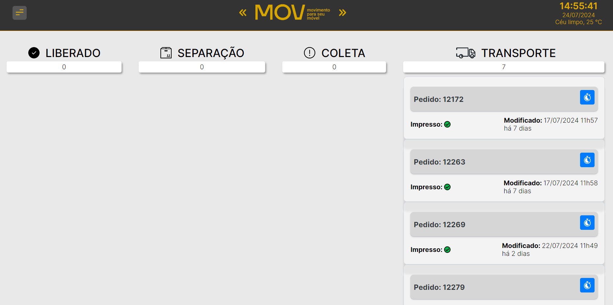

# Dashboard de Pedidos Wordpress



Este projeto é um dashboard de pedidos desenvolvido com React, Node.js e MySQL (MariaDB). 
Ele permite visualizar pedidos em tempo real.

## Tecnologias Utilizadas

- **Frontend**:
  - React
  - React Router DOM
  - Axios
  - React Icons
  - Date-fns
  - React Bootstrap
  
- **Backend**:
  - Node.js
  - Express.js
  - JWT (JSON Web Tokens)
  - bcrypt
  - Express Validator
  - MySQL2
  - WooCommerce REST API (para integração com WooCommerce)
  
- **Ferramentas de Desenvolvimento**:
  - Prettier (para formatação de código)
  - Nodemon (para reiniciar o servidor automaticamente durante o desenvolvimento)
  
- **Outras**:
  - dotenv (para carregar variáveis de ambiente a partir de um arquivo .env)
  - Cors (para habilitar CORS no backend)

## Funcionalidades

- **Visualização em Tempo Real**: Exibição de pedidos e atualizações em tempo real.
- **Cadastro e Autenticação**: Sistema de cadastro de usuários e autenticação via Token.
- **Integração com WooCommerce**: Sincronização de dados com WooCommerce.
- **Gerenciamento de Pedidos**: Consulta e atualização de status de pedidos.
- **Informações de Horário/Data**: Exibição do horário/data atual.
- **Informações de Clima**: Exibição da temperatura atual.

## Estrutura do Projeto

- **`/woocommerce-app`**: Contém a aplicação ReactJS com todos os componentes e estilos.
- **`/woocommerce-app-backend`**: Contém o código do servidor Node.js com Express e MySQL2.

## Instalação

1. **Clone o Repositório**:

    ```sh
    git clone <URL_DO_REPOSITORIO>
    cd <NOME_DO_PROJETO>
    ```

2. **Instalação das Dependências**:

    - Para o frontend:
    
      ```sh
      cd /woocommerce-app
      npm install
      ```

    - Para o backend:
    
      ```sh
      cd /woocommerce-app-backend
      npm install
      ```

3. **Configuração do Ambiente**:

    - Crie um arquivo `.env` na raiz do projeto e adicione as variáveis de ambiente necessárias.

      ```env
      # Utilize o arquivo `.env.example`
      ```

4. **Execução do Backend**:

    Execute:

    ```sh
    npm run dev
    ```

5. **Execução do Frontend**:

    Execute:

    ```sh
    npm run dev
    ```

6. **Acesso à Aplicação**:

    Abra o navegador e vá para `http://localhost:3000` para acessar a interface do usuário.

## Contribuição

Contribuições são bem-vindas! Sinta-se à vontade para enviar pull requests para melhorar o projeto.

## Autor

Desenvolvido por [Henrique Maximo](https://github.com/Henrry-Maximo)
